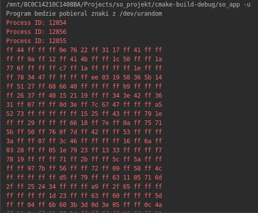
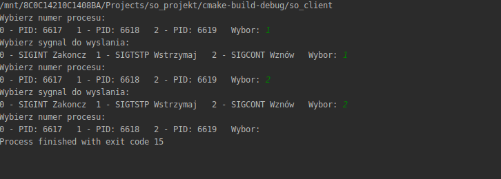

<h1>Operating system course project</h1>

<h2>Task</h2>

Develop a set of producer-consumer programmes implementing the following scheme of synchronous inter-process communication:
* Process 1: reads the data from the standard input stream and transfers it unchanged to process 2 through the K1 communication mechanism.
* Process 2: retrieves the data sent by process 1. Converts the data received from process 1 into a hexadecimal form and transfers it to process 3 through the K2 communication mechanism.
* Process 3: retrieves the data produced by Process 2 and outputs it to a standard diagnostic stream. The data units should be output 15 each in a single line and separated by spaces.

All three processes should be called automatically from one initiating process. When posterity processes are called, the initiating process stops working. The initiating process resumes work when the program ends (see below), its task is to "clean up" the program before it ends.

In addition, a mechanism of asynchronous transfer of information between the operator and processes and between processes should be implemented. Use the available signal mechanism for this.
The operator can send to any process an end of action signal (S1), a stop of action signal (S2) and a resume of action signal (S3). The S2 signal stops synchronous data exchange between processes. The S3 signal resumes this exchange. The S1 signal terminates the operation and releases any resources used by the processes (resources are released by the parent process).
Each of the signals is transmitted by the operator to only one, any process. The operator, not the programmer, decides to which process to send the signal. Each of the signals can be sent by the operator to a different process. Although the operator directs the signal to one process, the action desired by the operator must be performed by all three processes. Therefore, the process receiving the signal from the operator must notify the other two processes about the accepted request. It should therefore give them the appropriate signal, informing them of the action required by the operator. Processes receiving a signal should behave accordingly to the received signal. All three processes should react according to the operator's request.
Signals marked in the task description with S1 S3 symbols should be selected independently from those available in the system (e.g. SIGUSR1, SIGUSR2, SIGINT, SIGCONT).
Communication mechanisms: K1 and K2 are given in the file list_mechanizmow.pdf - each student has different communication mechanisms assigned.
Some communication mechanisms require the use of synchronization mechanisms, such as semaphores. 

The program is supposed to enable the launch:
*  in interactive mode - the operator enters data from the keyboard,
*  in the mode of reading data from a specific file,
*  in the /dev/urandom read mode.
    
Additional information:
For evaluation 5 (bdb) - sending signals to processes should be done using an additional program written in C language. 
This program should allow (using the user menu) to select the signal and the process to which the signal is to be sent.

<h2>View</h2>
<h3>Project app</h3>

<h3>Client app</h3>

<h2>Compilation</h2>
* With gcc
    * Compile project application
    <pre>
        Inside app folder:
        gcc -o main *.c
    </pre>

   * Compile client application
   <pre>
    Inside client folder
    gcc -o client client.c
    </pre>

* with cmake
    * Compile project application
    <pre>
          mkdir build && cd build
          cmake .. 
          make so_app
    </pre>
    * Compile project application
    <pre>
        > mkdir build && cd build 
          cmake .. 
          make so_client
    </pre>
    
<h2>Launch program  with mode</h2>
* -i - interactive mode
* -u - /dev/urandom read mode
* -f [filepath] - specific file reading mode

Example project application
<pre>
>>./main -f /dev/urandom
</pre>

Example client application
<pre>
./client 
</pre>

<h2>Communication between processes</h2>

* Between P1 and P2 - shared memory and synchronized with 2 semaphore
* Betwenn P2 and P3 - fifo

<h2>Signal used</h2>

* SIGINT - for stop communication between 3 processes
* SIGTSTP - for suspending communication
* SIGCONT - for resuming communication

